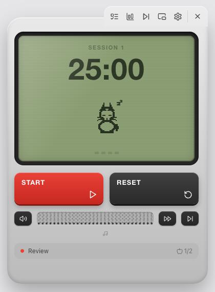

# Pomodoro Pet 🥚🐾

A retro **LCD-gadget Pomodoro timer** for **macOS and Windows**, built with Electron + React. A
pixel pet wakes up and grows as you complete focus sessions. Lives in the menu bar / system tray,
with an optional always-on-top mini widget and a strict-mode fullscreen break.

> Platform note: the timer, pet, six skins, audio, tasks, stats, mini widget and strict-mode
> break run on both macOS and Windows. The **Focus Shield** (active-tab site blocking) is
> macOS-only for now — it uses AppleScript; on Windows it's disabled rather than misbehaving.

**Install:** download the latest `.dmg` (macOS) or `.exe` (Windows) from the
[Releases](../../releases) page, or [build it yourself](#build). The builds are unsigned, so the
first launch needs right-click → **Open** on macOS / **More info → Run anyway** on Windows.



## Features

### Time management
- Customizable focus / short / long break lengths; long break automatically after _N_ cycles.
- Smooth **start / pause / skip / reset**.
- **Auto-start breaks** and **auto-start next work** toggles.

### Tasks & workflow
- Built-in **task manager**: add, edit, reorder, complete.
- **Pomodoro estimates** per task (🍅 done/estimated); finished pomodoros credit the active task.
- **Tags** (Coding / Writing / Admin / Study / Design / Other).
- **Analytics dashboard**: weekly/monthly focus-minute bar chart, by-tag pie chart, streak + milestones.

### Focus environment
- **Audio engine** — phase-aware music (focus / break) plus an ambient mixer (rain, ocean, white
  noise, café) with independent volumes. Ships with **synthesized, royalty-free** loops (generated
  with ffmpeg — safe, no licensing).
- **Bring your own music** — in Settings → **Music folder**, **choose any folder** (native picker)
  or **drag a folder** onto the panel from anywhere on disk; dropping a song picks its containing
  folder. Its songs (`.mp3/.m4a/.wav/.ogg/.flac`, e.g. from
  [pixabay.com/music](https://pixabay.com/music/)) become a **playlist**: they play one after
  another, and you can **fast-forward (⏩)** or **skip (⏭)** from the speaker bar (current track is
  shown below it). "Use default" reverts to the built-in app folder; an empty folder → the built-in
  lo-fi loop. Reserved names `rain/ocean/white/cafe.mp3` override the ambient loops. Served live via
  a `pomo-audio://` protocol — no rebuild.
- **Animated speaker grille** that visualizes whatever audio is playing.
- **Strict mode**: breaks take over the whole screen with a calming breathing animation + break
  music, to force a real rest.
- **Notification muting** during focus.
- **Focus shield** — during a strict-mode focus session, the app polls every ~1.2s and, when a
  blocklist entry (e.g. `youtube.com`) is open in your browser, **navigates that tab to
  `about:blank`** so the page can't be viewed (re-bounces if you go back), and shows a fullscreen
  "stay focused" overlay. Works across Safari, Chrome, Arc, Brave, Edge, Vivaldi via AppleScript
  (no root). Native apps (e.g. Slack) are matched by name and covered by the overlay. Needs macOS
  Automation permission the first time (use the **Test focus shield** button in Settings to grant
  it). Note: audio-only background tabs and the rare "Little Arc" popup aren't caught.

### Looks
- **Six skins** — Game Boy, Midnight, Mono, Sunset, Aurora, Neon — that re-style the whole
  **one-piece molded device** (casing, screen, glow, buttons, pet ink, and all the chrome so dark
  skins keep their contrast).
- **Live preview**: picking a skin in Settings → Look applies it to the device instantly, so you see
  it before you hit Apply (Cancel reverts to the previous skin).
- Lucide iconography throughout, with the controls grouped in a tab that sits on the device body.

### Pet, motivation & glanceability
- Six distinct pixel pets (cat/dog/panda/bunny/wolf/bear) that grow from small to full size as you focus.
- Streaks and milestone nudges.
- Menu-bar tray with a crisp clock icon + live `mm:ss`. Click it and the app opens as a single
  molded gadget anchored under the icon — a **draggable, frameless, always-on-top window** you can
  place anywhere (close with ✕ or the tray icon; it remembers where you put it and snaps back
  on-screen if a display changes). A floating **mini widget** (⌘⇧M) is one click away when you want a
  compact timer pinned over your work.
- **Single-widget rule**: the main window and mini widget are never shown at the same time — the
  main window only hides (keeping audio alive) so the timer/music never stop.

## Tech

- **electron-vite** (main / preload / renderer) + **electron-builder** (`.dmg`), **pnpm**.
- **React + TypeScript** renderer; **zustand** mirrors timer state pushed from the main process.
- The **timer engine is the single source of truth in the main process** so it ticks in the
  background and keeps the tray live. Audio + chime live in the main window (only hidden).
- Pixel pets are generated **procedurally** (no art files) — `src/renderer/src/pets/petData.ts`.

## Develop (pnpm)

```bash
pnpm install
pnpm dev          # launch with HMR
pnpm typecheck
```

### Dev helpers (env-gated)

| Env var                | Effect                                            |
| ---------------------- | ------------------------------------------------- |
| `POMO_SHOT=p.png`      | capture the main window after load                |
| `POMO_SHOT_MINI=p.png` | capture the mini window                           |
| `POMO_SHOT_STRICT=p`   | capture the strict-break window                   |
| `POMO_PANEL=tasks…`    | open a panel on launch (`tasks`/`stats`/`settings`) |
| `POMO_MINI=1`          | open the mini widget                              |
| `POMO_AUTOSTART=1`     | auto-start the countdown                          |
| `POMO_PHASE=short`     | start in a short break                            |

## Build

```bash
pnpm dist          # macOS  -> dist/Pomodoro Pet-<version>-arm64.dmg
pnpm dist:win      # Windows -> dist/Pomodoro Pet Setup <version>.exe  (NSIS installer)
```

`pnpm dist` produces an **arm64**, unsigned `.dmg` (add `- x64`/`- universal` under
`mac.target.arch` for Intel). `pnpm dist:win` produces an **x64 NSIS installer** — build it on
Windows, or on macOS/Linux with `wine` installed. Add signing certs for distribution.

> Offline note: `electron-builder` downloads the Electron binary from GitHub. If that's blocked,
> serve the cached `~/Library/Caches/electron/*/electron-v*.zip` (with a generated
> `SHASUMS256.txt`) via `python3 -m http.server` and set `ELECTRON_MIRROR=http://localhost:PORT/`.

## Landing site

A bold, dependency-free marketing site lives in [`website/`](website/) — open `index.html` in a
browser (works from the file system). It has a live, playable device hero. See `website/README.md`
to wire up the download link and deploy.

## Regenerate assets

```bash
node scripts/gen-assets.mjs   # app icon + anti-aliased menu-bar clock
# audio loops are generated with ffmpeg (synthesized, royalty-free)
```
